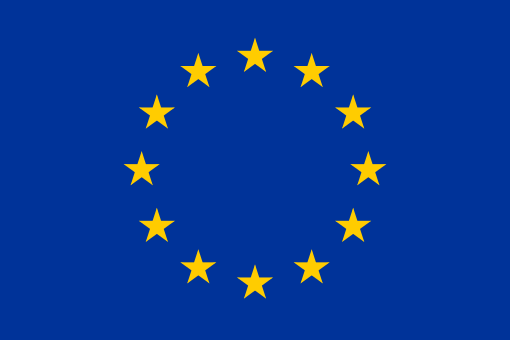

 
  
  Image Credit:
  <a src="https://www.reddit.com/r/HongKong/comments/dffh96/someone_drew_this_hong_kong_mei_and_asked_me_to/">Source</a>
  
<i>"The only thing necessary for the triumph of evil is for good men to do nothing."</i>

  
- Edmund Burke

 

## Summary
This is a comprehensive repository for many, if not all, topics related to Hong Kong.

<a name="links">
  <h2>
    
      Go To
  </h2>  
</a>

* [How to help Hong Kong protests from abroad](#help-hk)
  * [General](#help-hk-general)
  * [Monetary & Non-monetary Donations](#help-hk-monetary-and-non-monetary-donations)
  * [United States of America](#help-hk-usa)
  * [United Kingdom](#help-hk-uk)
  * [Canada](#help-hk-can)
  * [Australia](#help-hk-aus)
  * [New Zealand](#help-hk-nz)
  * [Europe](#help-hk-eu)
  * [China](#help-hk-cn)
  * [Others](#help-hk-others)
* [Past Achievements](#past-achievements)
* [Whitelisted Companies](#whitelisted-companies)
* [Blacklisted Companies](#blacklisted-companies)

---

<a name="help-hk">
  <h1>
    
      How to help Hong Kong protests from abroad
  </h1>  
</a>

Below is a list of ways to help Hong Kong from abroad. Currently, the list is being updated with this Reddit thread:

`https://www.reddit.com/r/HongKong/comments/cv0ws4/how_can_you_help_hong_kong_protests_from_abroad/?utm_source=share&utm_medium=ios_app&utm_name=iossmf`

Please feel free to request to add or remove entities from this list.

---
<a name="help-hk-general">
  <h2>
    GENERAL - anyone can sign the petitions below (no citizenship pre-requisite)
  </h2>  
</a>

1.1 Write to Carrie Lam urging her to IMMEDIATELY WITHDRAW the extradition bill [[Amnesty International]](https://www.amnesty.org/en/get-involved/take-action/stop-the-hong-kong-extradition-bill/)

1.2 Petition United Nations to Condemn Hong Kong Police for Excessive Use of Force and Call for an Independent Inquiry [[Petition United Nation]](https://www.change.org/p/condemn-hong-kong-police-for-excessive-force-against-citizens-call-for-independent-inquiry)

1.3 Request International Court of Justice to Investigate Excessive Force of Hong Kong Police [[Petition International Court of Justice]](https://www.change.org/p/international-court-of-justice-request-international-court-of-justice-to-investigate-excessive-force-of-hong-kong-police)

1.4 Cancel or postpone your trip to Hong Kong until the HK government meets all 5 Main Demands of the protesters. Do not give your money to Carrie Lam's government.

1.5 Support RTHK (Radio Television Hong Kong) editorial independence [[Petition for Editorial Independence]](https://www.change.org/p/hong-kong-people-%E5%85%A8%E5%8A%9B%E6%94%AF%E6%8C%81%E9%A6%99%E6%B8%AF%E9%9B%BB%E5%8F%B0-%E4%B8%80%E7%9B%B4%E7%A7%89%E6%8C%81%E7%B7%A8%E8%BC%AF%E8%87%AA%E4%B8%BB-%E6%96%B0%E8%81%9E%E6%99%82%E4%BA%8B%E7%AF%80%E7%9B%AE%E4%B8%8D%E5%81%8F%E4%B8%8D%E5%80%9A-%E4%B8%8D%E7%82%BA%E6%94%BF%E5%BA%9C%E5%96%89%E8%88%8C-%E4%B8%8D%E5%8F%97%E5%95%86%E6%A5%AD%E5%BD%B1%E9%9F%BF-%E4%BD%86%E7%82%BA%E5%B8%82%E6%B0%91%E7%99%BC%E8%81%B2)

1.6 Join [[#Eye4HK]](https://twitter.com/Eye4HK) Campaign]

1.7 Revoke Carrie Lam's Legion of Honor Award (France) [[Petition Grand Master of the Legion]](https://www.change.org/p/the-grand-chancery-of-the-legion-of-honor-revoke-hong-kong-chief-executive-carrie-lam-s-legion-of-honor-distinction-19c4dc0e-f0ca-433a-9496-08e6705dbdeb)

1.8 Setup [[Lennon Wall]](https://www.youtube.com/watch?v=e0NT-ewEMd4) (Post-it/Memo stickers) in your community

1.9 Join and support your local #StandwithHongKong rallies. [[Global events/rallies near you]](https://www.reddit.com/r/HongKong/comments/cwdb6i/another_big_global_rally_coming_up_lets_hold/?st=jzz6cvy8&sh=bf4a01e8)

1.10 Petition Amnesty for July 1st Legco Building Protesters [[Petition Amnesty for Legco Protesters]](https://www.change.org/p/please-help-support-unity-in-hong-kong-by-asking-legco-to-offer-amnesty-for-all-july-1st-2019-legco-protesters-%E7%82%BA%E5%9C%98%E7%B5%90%E9%A6%99%E6%B8%AF%E8%80%8C%E5%8A%AA%E5%8A%9B-%E8%AB%8B%E8%81%AF%E7%BD%B2%E8%A6%81%E6%B1%82%E9%A6%99%E6%B8%AF%E7%AB%8B%E6%B3%95%E6%9C%83%E8%B5%A6%E5%85%8D2019%E5%B9%B47%E6%9C%881%E6%97%A5%E5%88%B0%E7%AB%8B%E6%B3%95%E6%9C%83%E4%B9%8B%E7%A4%BA%E5%A8%81%E8%80%85)

1.11 Raise awareness of the Hong Kong protest. Spread the word to your friends, family, schoolmates, pray for Hong Kong with church, etc...

1.12 Join [[r/HongKong]](https://www.reddit.com/r/HongKong/) subscribe, like, thumbsup, follow, share pro-Democracy Hong Kong social media or channels

`#StandWithHongKong #Eye4HK #NoChinaExtradition #antiELAB #SOSHK #反送中 #FreeHongKong #StandwithHK #HKLastwords #SaveHongKong #HongKongProtest #DemocracyNow #NoExtraditionToChina #Shout4HK #Mask4HK #BoycottBlizzard`

1.14 Make Meme, posters, videos, drawings, sing a song to express your solidarity with Hong Kongers

1.15 Reporting HKPF to the International Police Association (IPA) for breach of professional code of conduct and excessive use of force [[Petition International Police Association]](https://www.change.org/p/international-police-association-reporting-misconduct-of-hong-kong-police-force-during-the-protest-in-hong-kong?recruiter=false&utm_source=share_petition&utm_medium=twitter&utm_campaign=psf_combo_share_message&utm_term=share_petition&recruited_by_id=4e0f5610-c6bc-11e9-8ef7-4d89fc670684&share_bandit_exp=message-16946662-en-US&share_bandit_var=v3)

1.16 Urge U.N. to Monitor Hong Kong's District Council Election on Nov 24th, 2019 to Fight Voter Suppression and Election Fraud [[Petition for clean and fair district election]](https://petitions.whitehouse.gov/petition/urge-un-monitor-hong-kongs-district-council-election-112419-fight-voter-suppression-and-election-fraud)

1.17 Petition to terminate franchise Starbucks to Maxim's in Hong Kong [[Change.org Starbucks]](https://www.change.org/p/management-and-shareholders-of-starbucks-starbucks-to-stop-giving-franchise-to-hong-kong-maxim-s-group-%E8%81%AF%E7%BD%B2%E8%A6%81%E6%B1%82starbucks-%E5%81%9C%E6%AD%A2%E7%BE%8E%E5%BF%83%E5%9C%A8%E6%B8%AF%E5%B0%88%E7%87%9F%E6%AC%8A)

---
<a name="help-hk-monetary-and-non-monetary-donations">
  <h2>
    MONETARY AND NON-MONETARY DONATIONS
  </h2>  
</a>

2.1 612 Humanitarian Relief Fund [[Legal Aid]](https://www.facebook.com/612Fund/posts/379578696075634)

2.2 Hong Kong Free Press [[Not-for-Profit News]](https://www.hongkongfp.com/support-hkfp/)

2.3 The Stand News [[Not-for-Profit News, Cantonese]](https://mystand.thestandnews.com)

2.4 Hong Kong Public Opinion Research Institute [[Independent Research]](https://www.pori.hk/donation)

2.5 ~~[[HK Protect]](https://hkprotect.org/shop/%E4%BF%9D%E8%AD%B7%E8%A3%9D%E5%82%99/%E6%8D%90%E8%B4%88%E8%A3%9D%E5%82%99%E9%80%81%E7%B5%A6%E5%89%8D%E7%B7%9A/) Helped supply protective gears to HK protesters~~ (Temporary closed as at Aug 29th)

2.6 SparkAlliance [[Legal Aid]](https://www.facebook.com/sparkalliancehk/#) (Click on FB "See Translation")

2.7 Hong Kong Citizen News [[Not-for-Profit News, Cantonese]](https://www.hkcnews.com/aboutus/)

2.8 A team of Hong Kong Volunteer Medics crowdfunding [[image]](https://i.imgur.com/OOG7U12.jpg) for first aid supplies, saline water to wash eyes from tear gas, helmets, gas mask filters, etc... [[check out the Update tab]](https://gogetfunding.com/fight-for-hong-kongs-freedom)

2.9 Sue the Abuser [[crowdfunding]](https://www.lsd.org.hk/donate/?lang=en) (accepts PayPal/Credit Card) [[News Article]](https://www.hongkongfp.com/2019/09/19/hk10m-crowdfunding-campaign-aims-help-victims-sue-hong-kong-police-alleged-mistreatment)

2.10 Hong Kong Higher Institutions International Affairs Delegations (HKIAD) lobbies international governments. An example: lobby US Congress to pass the HK Human Rights and Democracy Act 2019. [[Crowdfunding]](https://gogetfunding.com/hkiad-crowdfunding)

2.11 How to send protective gears to Hong Kong front line protesters via a US contact [[Click for further information]](https://www.reddit.com/r/HongKong/comments/ddf659/collecting_protective_gears_to_be_sent_to_hong)

2.12 Giving away free #StandwithHongKong T-shirts at [[Blizzcon 2019]](https://www.facebook.com/events/501411020413254), Los Angeles Oct 31 - Nov 2 [[Crowdfunding]](https://www.gofundme.com/f/blizzcon-shirts-supporting-hong-kong)

---
 
<a name="help-hk-usa">

  <h2>
    UNITED STATES OF AMERICA (USA)
  </h2>  
</a>

3.1 Write to US Congress (Senators and Representatives)

[[Find your representative]](https://www.house.gov/representatives/find-your-representative)

[[How to correspond Senators]](https://www.senate.gov/senators/How_to_correspond_senators.htm)

3.2 Ask Your US Representatives to Co-Sponsor the [[Hong Kong Human Rights and Democracy Act of 2019]](https://actionnetwork.org/letters/co-sponsor-hong-kong-human-rights-and-democracy-act-of-2019)

3.3 [[Call your representative]](https://www.callmycongress.com) and tell them you are very concerned about the situation in Hong Kong, the excessive amounts tear gas used, some of which are expired, releases dangerous levels of hydrogen cyanide that could literally kill a person, which qualifies as chemical weapons, a flagrant violation of international law. Please support the Hong Kong Human Rights and Democracy Act 2019 by passing the [[House Bill H.R. 3289]](https://www.congress.gov/bill/116th-congress/house-bill/3289) / [[Senate Bill S.1838]](https://www.congress.gov/bill/116th-congress/senate-bill/1838) and review/revoke the United States - Hong Kong Policy Act 1992. It's in the interest of leaders who value democracy, international laws, human rights, to stand up for those who don't have the same freedoms we have. Thank you.

3.4 Impose Global Magnitsky Act sanctions against Chinese officials [[Petition Global Magnitsky Act]](https://petitions.whitehouse.gov/petition/call-imposing-global-magnitsky-act-santions-and-other-measures-against-chinese-officials-and-their-interests)

3.5 Petition 12 US Congress leaders to support the Hong Kong Human Rights and Democracy Act [[Pass the Act S.1838/H.R.3289]](https://www.change.org/p/general-public-support-hong-kong-human-rights-and-democracy-act-s-1838-h-r-3289)

3.6 Ask Your US Representatives to Co-Sponsor the Protect Hong Kong Act of 2019 [[H.R. 4270]](https://www.congress.gov/116/bills/hr4270/BILLS-116hr4270ih.pdf) to place restrictions on teargas exports and crowd control technology to Hong Kong

---
 
<a name="help-hk-uk">

  <h2>
    UNITED KINGDOM (UK)
  </h2>  
</a>

4.1 Write to your [[Members of Parliament]](https://www.parliament.uk/get-involved/contact-your-mp/
) (UK)

4.2 [[Petition UK]](https://petition.standwithhk.org) to Uphold the 1984 Sino-British Joint Declaration

4.3 [[Petition Liz Truss]](https://you.38degrees.org.uk/petitions/uk-should-safeguard-human-rights-and-rule-of-law-in-hong-kong-in-future-trade-deals
) from Department of International Trade and Dominic Raab from Foreign and Commonwealth Office to Stand up for Human Rights in Hong Kong

---
 
<a name="help-hk-can">

  <h2>
    CANADA (CAN)
  </h2>  
</a>

5.1 Write to your [[Members of Parliament]](https://www.ourcommons.ca/Parliamentarians/en/constituencies/FindMP) (CAN)

5.2 Stand up for Hong Kong and [[petition]](https://chkl.ca ) to Canadian MPs and Federal Elections Candidates **(Deadline: Oct 20th)**

5.3 `#BoycottBlizzard` if you are a Canadian player, instead of just deleting your account, [[you should request PIPEDA]](https://www.reddit.com/r/HongKong/comments/dfcncg/dont_just_delete_your_account_you_can_request) (Personal Information Protection and Electronics Documents Act) and if they do not comply within 30 days, you can complaint to the Canada's Federal Privacy Commissioner

---
 
<a name="help-hk-aus">

  <h2>
    AUSTRALIA (AUS)
  </h2>  
</a>

6.1 Write to your [[Senators and Members of Parliament]](https://www.aph.gov.au/senators_and_members/guidelines_for_contacting_senators_and_members) (AUS)

6.2 [[Australian Taxpayers' Alliance Campaign]](https://www.taxpayers.org.au/save-hong-kong) to save Hong Kong 

6.3 Expel the Chinese Consul General in Brisbane, Queensland, Australia [[Dear Australian Prime Minister]](https://www.change.org/p/the-prime-minister-of-australia-expel-the-chinese-consul-general-in-brisbane-%E8%A6%81%E6%B1%82%E6%BE%B3%E6%B4%B2%E6%94%BF%E5%BA%9C%E9%A9%85%E9%80%90%E4%B8%AD%E5%85%B1%E9%A7%90%E5%B8%83%E9%87%8C%E6%96%AF%E6%9C%AC%E7%B8%BD%E9%A0%98%E4%BA%8B)

6.4 Impose Sanctions on Persons Found to be Suppressing Human Rights in Hong Kong [[Petition Australian Senate]](https://www.change.org/p/the-senate-of-australia-impose-sanctions-on-persons-found-to-be-suppressing-human-rights-in-hong-kong-df999fe5-3d9f-434b-8f58-d0840619a046)

6.5 Petition Australian House of Representative to bring the true condition of Hong Kong’s predicament to the United Nations Human Rights Council [[Petition EN1029]](https://www.aph.gov.au/petition_sign?id=EN1029) **(Dateline: Oct 9th)**

6.6 Petition Australia to add Human Rights clauses to the Australia - Hong Kong Free Trade Agreement [[Petition E1032]](https://www.aph.gov.au/petition_sign?id=EN1032) (**Dateline: Oct 9th)**

6.7 Petition Australia to grant asylums to Hong Kongers [[Petition EN1022]](https://www.aph.gov.au/petition_list?id=EN1022) **(Dateline: Oct 9th)**

---
 
<a name="help-hk-nz">

  <h2>
    NEW ZEALAND (NZ)
  </h2>  
</a>

7.1 Write to your [[Members of Parliament]](https://www.govt.nz/browse/engaging-with-government/members-of-parliament/) (NZ)

---
 
<a name="help-hk-eu">

  <h2>
    EUROPE (EU)
  </h2>  
</a>

8.1 Write to Your [[Members of European Parliament]](http://www.europarl.europa.eu/meps/en/search/advanced) (EU)

8.2 Petition to Jean Yves Le Drian, Minister of Europe and Foreign Affairs of the French Republic calling for concrete actions against China to respect Hong Kong’s autonomy to prevent a humanitarian crisis [[Petition to Jean Yves Le Drian]](https://www.change.org/p/m-jean-yves-le-drian-ministre-de-l-europe-et-des-affaires-%C3%A9trang%C3%A8res-de-la-r%C3%A9publique-fran%C3%A7aise-des-mesures-pour-pr%C3%A9venir-une-%C3%A9ventuelle-crise-humanitaire-%C3%A0-hong-kong-fr-en-5a3626a8-8c77-4d6e-8346-141c1ddd6325)

8.3 `#BoycottBlizzard` if you are an EU player, instead of just deleting your account, [[you should request GDPR]](https://www.reddit.com/r/HongKong/comments/dfcncg/dont_just_delete_your_account_you_can_request) (General Data Protection Regulations) and if they do not comply within 30 days, they will have to pay a hefty fine of 4% of Global Annual Turnover of Blizzard.

---
 
<a name="help-hk-cn">

  <h2>
    CHINA (CN)
  </h2>  
</a>

9.1 Speak out but be anonymous. Let other Chinese, Hong Kong people, the world know that there are Chinese or Mainland Chinese who do supports the Hong Kong protest.

---
<a name="help-hk-others">
  <h2>
    OTHERS
  </h2>  
</a>

10.1 Switzerland Write to your [[local representatives]](https://www.parlament.ch/en/ratsmitglieder?k=)

10.2 Japan Write to your local representatives and councilors

http://www.shugiin.go.jp/internet/itdb_english.nsf/html/statics/member/mem_a.htm

https://www.sangiin.go.jp/japanese/joho1/kousei/eng/members/index.htm

10.3 Petition Japanese parliamentarians to introduce a Hong Kong Human Rights and Democracy Bill in Japan [[Petition Japan]](https://www.change.org/p/%E5%9B%BD%E4%BC%9A%E8%AD%B0%E5%93%A1-%E9%A6%99%E6%B8%AF%E3%81%AB%E3%81%8A%E3%81%91%E3%82%8B%E6%94%BF%E5%BA%9C%E5%BD%93%E5%B1%80%E3%81%AB%E3%82%88%E3%82%8B%E5%BC%B7%E6%A8%A9%E7%9A%84%E3%81%AA%E5%8B%95%E3%81%8D%E3%82%92%E3%81%91%E3%82%93%E5%88%B6%E3%81%99%E3%82%8B%E3%81%9F%E3%82%81-%E6%97%A5%E6%9C%AC%E7%89%88-%E9%A6%99%E6%B8%AF%E4%BA%BA%E6%A8%A9-%E6%B0%91%E4%B8%BB%E4%B8%BB%E7%BE%A9%E6%B3%95%E6%A1%88-%E3%81%AE%E8%AD%B0%E8%AB%96%E3%82%92%E9%96%8B%E5%A7%8B%E3%81%99%E3%82%8B%E3%81%93%E3%81%A8%E3%82%92%E6%97%A5%E6%9C%AC%E3%81%AE%E5%9B%BD%E4%BC%9A%E8%AD%B0%E5%93%A1%E3%81%AB%E6%B1%82%E3%82%81%E3%81%BE%E3%81%99?utm_content=cl_sharecopy_17285742_ja-JP%3Av1&recruiter=34591470&recruited_by_id=e96e94b0-151b-0130-6dd2-3c764e049c4f&utm_source=share_petition&utm_medium=copylink&utm_campaign=psf_combo_share_initial)

---
<a name="past-achievements">
  <h1>
    
      Past Achievements
  </h1>  
</a>

100k+ signatories : Petition White House to nominate Hong Kong Protesters for Nobel Peace Prize 2020

100k+ signatories : Petition White House to suspend crowd control equipment exports to Hong Kong

100k+ signatories : Petition White House to pass the Hong Kong Human Rights and Democracy Act

HKD 3m+ raised for Hong Kong Journalist Association Protection Fund

HKD 200k+ raised for [[Lady Liberty Hong Kong]](https://gogetfunding.com/%E8%A3%BD%E4%BD%9C%E3%80%90%E6%96%B0%E9%A6%99%E6%B8%AF%E6%B0%91%E4%B8%BB%E5%A5%B3%E7%A5%9E%E5%83%8F%E3%80%91production-of-lady-liberty-hong-kong/?lang=en) (Statue) [[3DPrint Your Own #LadyLibertyHK]](https://www.reddit.com/r/HongKong/comments/dd39y7/ladylibertyhk_figurine_standing_in_solidarity) (free 3D file included)

100k+ signatories : [[Sanction Hong Kong government for its State Terrorism conducted in Prince Edward train station]](https://petitions.whitehouse.gov/petition/sanction-hong-kong-government-its-state-terrorism-conducted-prince-edward-train-station-hong-kong-831)

100k+ signatories : [[Reject nomination of Andy Tsang (former Police Chief of HK) for positions in United Nations]](https://petitions.whitehouse.gov/petition/please-reject-nomination-andy-tsang-wai-hung-positions-united-nations?fbclid=IwAR0VJ4ljlgSujT-40K5_VX9ZnOZ8Wa8cXjYdHelxX0ZFb9tBBn2JRFfkRSg)

HKD 8m+ raised for [[advertisements in major newspapers around the world People's Republic of China's 70th Anniversary]](https://gogetfunding.com/g20celebratemotherbirthday)

Petition to the Canadian government [[e-2268]](https://petitions.ourcommons.ca/en/Petition/Details?Petition=e-2268) sponsored by MP Michael Chong (Closed upon dissolution)

Serena Lee's petition to address the violation of human rights in Hong Kong : Stand with [[Serena Lee]](https://www.parliament.nz/en/pb/petitions/document/PET_90982/petition-of-serena-lee-address-the-violation-of-human)

100k+ signatories : [[Petition UK to give full British Citizenship to British National Overseas (BNO) passport holders]](https://petition.parliament.uk/petitions/244402)

HKD1.8m+ raised [[催淚之城 The City of Tears]](https://www.kickstarter.com/projects/cori226/the-city-of-tears) Documentary of Hong Kong, Summer of 2019 (Goal achieved < 16 hours)

USD40k+ raised [[Giving away free Stand with Hong Kong T-shirts at NBA Opening Night]](https://www.gofundme.com/f/free-hong-kong-tshirts-on-nba-opening-night)

---
 
<a name="whitelisted-companies">
  <h1>
    
      Whitelisted Companies
  </h1>  
</a>

This list is for companies who have stood up to Chinese censorship demands and refused to be censored

| Name of Company                           | Date Added | Why added                                                    | Sources                                                      |
| ----------------------------------------- | ---------- | ------------------------------------------------------------ | ------------------------------------------------------------ |
| Matt Stone & Trey Parker (Comedy Central) | 2019-10-09 | Released South Park episode mocking Chinese censorship, causing show to be censored in China, then issued a mock apology. In a followup episode, there is a scene where characters scream "fuck the Chinese government!" | <ul><li>[BBC](https://www.bbc.co.uk/news/world-asia-china-49968867)</li><li>[Business Insider](https://www.businessinsider.com/south-park-takes-on-chinese-government-in-300th-episode-2019-10)</li></ul> |
| Ubisoft                                   | 2019-10-09 | Refused to implement aesthetic changes ordered by China to game, however this was a U-Turn following an earlier decision to comply | <ul><li>[Windows Central](https://www.windowscentral.com/rainbow-six-siege-drops-china-censorship-reverts-aesthetic-changes)</li></ul> |
| Prague City Council                       | 2019-10-09 | Canceled sister city agreement with Beijing after China refused to remove clause in agreement which stipulated that the council must support the "one-china" principle | <ul><li>[SCMP](https://www.scmp.com/news/china/diplomacy/article/3032045/prague-cuts-sister-city-ties-beijing-amid-tangible-anger-over)</li></ul> |
| Epic Games                                | 2019-10-09 | CEO Tim Sweeney made a statement on twitter claiming that the company will not take action against players who voice support for the Hong Kong protests | <ul><li>[Twitter](https://twitter.com/TimSweeneyEpic/status/1181946357759844352)</li></ul> |
| Immutable                                 | 2019-10-10 | Covered the prize money of the gamer banned from Hearthstone | <ul><li>[SMH](https://www.smh.com.au/business/companies/sydney-startup-under-fire-online-for-supporting-pro-hong-kong-protest-gamer-20191009-p52z2g.html)</li></ul>  |
| Omegle                                 | 2019-10-11 | Displayed the statements "Xi Jinping sure looks like Winnie the Pooh" and "Stand with Hong Kong!" on their homepage; Suggested messages upon starting a chat included messages like "The Tienanmen Square massacre was evil" | <ul><li>[Reddit](https://www.reddit.com/r/HongKong/comments/dfwmve/omegle_is_fighting_for_hong_kong_too/)</li><li>[Web Archive](http://web.archive.org/web/20191011144103/https://www.omegle.com/)</li></ul>    |

---
 
<a name="blacklisted-companies">
  <h1>
    
      Blacklisted Companies
  </h1>  
</a>

Naming and shaming companies who kowtow to Chinese censorship requests

[//]: # "BEGIN:TABLE"

| Name of Company | Date Occurred | Date Added | Why added | Sources |
| --------------- | ------------ | ---------- | --------- | ------- |
| Blizzard Entertainment | 2019-10-05 | 2019-10-08 | Banned a player who voiced support for the HK protests, rescinded his prize money and fired the 2 casters that were with him on air |  <ul><li>[CNN](https://edition.cnn.com/2019/10/08/tech/hearthstone-hong-kong-intl-hnk-scli)</li><li>[Kotaku](https://kotaku.com/blizzard-suspends-hearthstone-player-for-hong-kong-supp-1838864961)</li><li>[Play Hearthstone](https://playhearthstone.com/en-us/blog/23179289)</li></ul>
| Apple | 2019-10-03 | 2019-10-08 | Removed HK police tracking app from the HK app store after pressure from the CCP; Removed Taiwan flag emoji in Hong Kong | <ul><li>[The Verge](https://www.theverge.com/2019/10/7/20903613/apple-hiding-taiwan-flag-emoji-hong-kong-macau-china)</li><li>[Tech Crunch](https://techcrunch.com/2017/07/29/apple-removes-vpn-apps-from-the-app-store-in-china)</li><li>[The Intercept](https://theintercept.com/2019/02/01/apple-apps-china-censorship/)</li></ul>|
| NBA | 2019-10-04 | 2019-10-08 | After Daryl Morey, manager of the Houston Rockets, published a tweet supportive of the HK protests, NBA issued an apology, calling the tweet "inappropriate". NBA Commissioner Adam Silver later contradicted this stance and said "We are not apologizing for Daryl exercising his freedom of expression" | <ul><li>[Independent](https://www.independent.co.uk/news/world/asia/houston-rockets-hong-kong-protests-china-nba-tencent-apology-twitter-a9146211.html)</li><li>[Kyodonews](https://english.kyodonews.net/news/2019/10/6d7f9f7d53b0-basketball-there-are-regrets-but-no-apology-nbas-silver.html)</li></ul>|
| Marriott | 2018-01-12 | 2019-10-08 | Fired an employee after he "liked" an online post about Tibet; De-listed Taiwan as a nation, listed it instead as part of China after Chinese pressure; Released a statement reading "Marriott International respects the sovereignty and territorial integrity of China. We don’t support separatist groups that subvert the sovereignty and territorial integrity of China" | <ul><li>[SCMP](https://www.scmp.com/news/china/policies-politics/article/2160030/taiwan-hotel-cuts-ties-marriott-protest-caving-beijing)</li><li>[The Guardian](https://www.theguardian.com/world/2018/jan/12/marriott-apologises-to-china-over-tibet-and-taiwan-error)</li></ul>|
| Vans | 2019-10-05 | 2019-10-08 | Removed contest submission depicting the protests in Hong Kong | <ul><li>[Reuters UK](https://uk.reuters.com/article/us-hongkong-protests-vans/shoemaker-vans-treads-warily-as-china-fumes-over-hong-kong-protests-idUKKBN1WN0IZ)</li><li>[Reuters](https://www.reuters.com/article/us-hongkong-protests-vans/shoemaker-vans-treads-warily-as-china-fumes-over-hong-kong-idUSKBN1WN0IZ)</li></ul> |
| Gap Inc. | 2018-05-14 | 2019-10-08 | Apologized after a T-Shirt depicting China without Taiwan was sold at a store in Canada, issuing the statement "Gap Inc. respects China's sovereignty and territorial integrity. We've learned that a Gap brand T-shirt sold in some overseas markets failed to reflect the correct map of China in the design" | <ul><li>[CNN](https://money.cnn.com/2018/05/15/news/companies/gap-tshirt-map-of-china/index.html)</li><li>[Reuters](https://www.reuters.com/article/us-china-gap/gap-apologizes-for-selling-t-shirt-with-incorrect-map-of-china-idUSKCN1IG02Y )</li></ul>  |
| Tiffany and Co | 2019-10-07 | 2019-10-08 | Removed tweet showing model covering her right eye (angry Chinese netizens believed it to be a reference to the woman who lost her eye after being hit by a police projectile) | <ul><li>[Yahoo](https://news.yahoo.com/tiffany-removes-advert-over-hong-kong-controversy-093418861.html)</li></ul>   |
| Nike | 2019-10-09 | 2019-10-09 | Removed all Houston Rockets merch from their China stores (web and physical) | <ul><li>[Reuters](https://www.reuters.com/article/us-china-basketball-nba-nike/houston-rockets-nike-merchandise-disappears-from-china-stores-idUSKBN1WP109)</li><li>[Fade Away World](https://fadeawayworld.net/2019/10/08/nike-removes-all-houston-rockets-related-products-from-their-china-webstore/)</li></ul>  |
| ESPN | 2019-10-08 | 2019-10-09 | Chuck Salituro, the senior news director of ESPN, sent a memo to shows mandating that any discussion of the Daryl Morey story avoid any political discussions about China and Hong Kong; ESPN displayed a Chinese map complete with 9 dash line, Taiwan, and also Arunachal Pradesh, which is a part of India that China claims is part of China | <ul><li>[Dead Spin](https://deadspin.com/internal-memo-espn-forbids-discussion-of-chinese-polit-1838881032)</li><li>[Shanghaiist](https://shanghaiist.com/2019/10/10/espn-uses-map-of-china-complete-with-nine-dash-line-taiwan-and-arunachal-pradesh/)</li></ul>  |
| Viacom / Paramount | 2019-07-18 | 2019-10-09 | Removed Taiwan flag from Maverick's jacket |  <ul><li>[CNBC](https://www.cnbc.com/2019/07/19/tom-cruises-top-gun-jacket-shows-how-key-china-is-to-film-industry.html)</li></ul>  |
| Disney / Marvel | 2016-11-04 | 2019-10-09 | Censored Tibetan monk from "Doctor Strange" and turned him into a white woman: the "Ancient One" was Tibetan in the comics, but white in the film. Statement from C. Robert Cargill, screenwriter: "If you acknowledge that Tibet is a place and that he’s Tibetan, you risk alienating one billion people who think that that’s bullshit" |  <ul><li>[Buzzfeed News](https://www.buzzfeednews.com/article/krishrach/tibetan-activist-are-not-happy-with-dr-strange)</li></ul>  |
| Cathay Pacific | 2019-08-09 | 2019-10-09 | Fired staff members who expressed support for the HK protests | <ul><li>[The Guardian](https://www.theguardian.com/world/2019/aug/28/cathay-pacific-denounced-for-firing-hong-kong-staff-on-china-orders)</li><li>[Reuters](https://www.reuters.com/article/us-hongkong-protests-cathay-pacific-insi/as-protests-rack-hong-kong-china-watchdog-has-cathay-staff-walking-on-eggshells-idUSKBN1WI0MA)</li></ul>   |
| Mercedes | 2018-02-06 | 2019-10-09 | Apologised to China after quoting the Dalai Lama in an Instagram post, also deleting the post |  <ul><li>[Mercedes](https://www.telegraph.co.uk/news/2018/02/07/mercedes-apologises-china-quoting-dalai-lama/)</li><li>[Reuters](https://www.reuters.com/article/us-mercedes-benz-china-gaffe/mercedes-benz-apologizes-to-chinese-for-quoting-dalai-lama-idUSKBN1FQ1FJ)</li></ul>   |
| Delta Airlines | N/A | 2019-10-09 | De-listed Taiwan as a country on their website, instead listing it as part of China |  <ul><li>[Business Insider](https://www.businessinsider.com/which-companies-have-changed-taiwan-description-china-2018-7?r=US&IR=T)</li></ul>  |
| American Airlines | N/A | 2019-10-09 | De-listed Taiwan as a country on their website | <ul><li>[Business Insider](https://www.businessinsider.com/which-companies-have-changed-taiwan-description-china-2018-7?r=US&IR=T)</li></ul>  |
| United Airlines | N/A | 2019-10-09 | De-listed Taiwan as a country on their website |  <ul><li>[Business Insider](https://www.businessinsider.com/which-companies-have-changed-taiwan-description-china-2018-7?r=US&IR=T)</li></ul> |
| Qantas | N/A | 2019-10-09 | De-listed Taiwan as a country on their website, instead listing it as a province of China |  <ul><li>[Business Insider](https://www.businessinsider.com/which-companies-have-changed-taiwan-description-china-2018-7?r=US&IR=T)</li></ul> |
| Air France | N/A | 2019-10-09 | De-listed Taiwan as a country on their website, instead listing it as a province of China |  <ul><li>[Business Insider](https://www.businessinsider.com/which-companies-have-changed-taiwan-description-china-2018-7?r=US&IR=T)</li></ul>|
| Lufthansa | N/A | 2019-10-09 | De-listed Taiwan as a country on their website, instead listing it as a province of China |  <ul><li>[Business Insider](https://www.businessinsider.com/which-companies-have-changed-taiwan-description-china-2018-7?r=US&IR=T)</li></ul> |
| Air Canada | N/A | 2019-10-09 | De-listed Taiwan as a country on their website, instead listing it as a province of China |  <ul><li>[Business Insider](https://www.businessinsider.com/which-companies-have-changed-taiwan-description-china-2018-7?r=US&IR=T)</li></ul> |
| British Airways | N/A | 2019-10-09 | De-listed Taiwan as a country on their website, instead listing it as a province of China |  <ul><li>[Business Insider](https://www.businessinsider.com/which-companies-have-changed-taiwan-description-china-2018-7?r=US&IR=T)</li></ul>|
| Malaysia Airlines | N/A | 2019-10-09 | De-listed Taiwan as a country on their website, instead listing it as a province of China |  <ul><li>[Business Insider](https://www.businessinsider.com/which-companies-have-changed-taiwan-description-china-2018-7?r=US&IR=T)</li></ul> |
| Audi | N/A | 2019-10-09 | Apologised after using a map of China that didn't include Taiwan |  <ul><li>[Business Insider](https://www.businessinsider.com/which-companies-have-changed-taiwan-description-china-2018-7?r=US&IR=T)</li></ul> |
| Muji | N/A | 2019-10-09 | Apologised after featuring a map of China in a store catalog that didn't include the Senkaku islands, destroyed the catalogs |  <ul><li>[Business Insider](https://www.businessinsider.com/which-companies-have-changed-taiwan-description-china-2018-7?r=US&IR=T)</li></ul> |
| Zara | N/A | 2019-10-09 | Apologised for listing Taiwan as a country on their website |  <ul><li>[Sixth One](https://www.sixthtone.com/news/1001549/zara-apologizes-for-listing-taiwan-as-country)</li></ul> |
| Ray-Ban | N/A | 2019-10-09 | De-listed Taiwan as a country on their website | <ul><li>[Business Insider](https://www.businessinsider.com/which-companies-have-changed-taiwan-description-china-2018-7?r=US&IR=T)</li></ul>   |
| Sheraton Hotels and Resorts | N/A | 2019-10-09 | Barred a Taiwan National Day reception from taking place at their Stockholm hotel, at the request of the Chinese ambassador | <ul><li>[Taiwan News](https://www.taiwannews.com.tw/en/news/3791266)</li></ul> |
| Rockhampton Council, Queensland, Australia | N/A | 2019-10-09 | Removed Taiwan flags from public artwork | <ul><li>[ABC](https://www.abc.net.au/news/2018-05-09/childrens-cow-statue-design-altered-taiwan-flag-painted-over-qld/9739574)</li></ul>  |
| Global Blue | N/A | 2019-10-09 | Fired a member of staff for calling Taiwan a country | <ul><li>[Global Times](http://www.globaltimes.cn/content/1161789.shtml)</li></ul> |
| Lancome (L'Oreal) | N/A | 2019-10-09 | Canceled Denise Ho concert after Denise Ho expressed support for 2014 Hong Kong protests | <ul><li>[BBC](https://www.bbc.co.uk/news/world-asia-china-36457450)</li></ul>  |
| Givenchy | N/A | 2019-10-10 | Apologized for identifying Hong Kong and Taiwan as an independent country on their T-Shirts. | <ul><li>[CNN](https://www.cnn.com/style/article/coach-givenchy-versace-t-shirt-controversy/index.html)</li></ul>  |
| Coach | N/A | 2019-10-10 | Apologized for identifying Hong Kong and Taiwan as an independent country on their T-Shirts. | <ul><li>[CNN](https://www.cnn.com/style/article/coach-givenchy-versace-t-shirt-controversy/index.html)</li></ul> |
| Versace | N/A | 2019-10-10 | Apologized for identifying Hong Kong and Taiwan as an independent country on their T-Shirts. | <ul><li>[CNN](https://www.cnn.com/style/article/coach-givenchy-versace-t-shirt-controversy/index.html)</li></ul> |
| JYP Entertainment | 2016-01-16 | 2019-10-11 | Forced Taiwanese kpop idol Chou Tzu-yu to release an apology video after she was seen waving a Taiwan flag | <ul><li>[NY Times](https://www.nytimes.com/2016/01/17/world/asia/taiwan-china-singer-chou-tzu-yu.html)</li></ul> |
| Tiktok | 2019-09 | 2019-10-11 | Instructed moderators to censor videos that would upset Beijing | <ul><li>[The Guardian](https://www.theguardian.com/technology/2019/sep/25/revealed-how-tiktok-censors-videos-that-do-not-please-beijing)</li></ul> |

[//]: # "END:TABLE"

